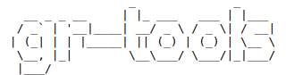

<p align="center">
  
</p>

---

# gr-tools

Commands to make my life easier

## Requirements

* Node.js
* NPM

## Used in

* Ubuntu
* Linux Mint

## Installing

```
$ npm install -g gr-tools
```

## Commands

### Clone my github repositories

Clone all my repositories from github:

```
$ gr-tools clone github
```

Clone all my repositories from github executing `npm install` on repositories with `package.json` file:

```
$ gr-tools clone github --npm-install
```

Clone all repositories of `filipedeschamps` from github:

```
$ gr-tools clone github --user=filipedeschamps
```

### Area screenshot

```
$ gr-tools screenshot
```

### Update system

```
$ gr-tools update system
```

### Update GR Tools

```
$ gr-tools update gr-tools

# or

$ gr-tools update me
```

### Setup typescript environment

```
$ gr-tools setup typescript
```

### Setup development environment

```
$ gr-tools setup development
```

### Up version of a package.json

```
$ gr-tools npm up-version
```

## CONTRIBUTING

Contributions are very welcome!

### Scripts

#### Development

```bash
$ npm run dev
```

Removes possible `gr-tools` globally installed and executes `npm link` for testing while developing.

#### Deploy

```
$ npm run deploy
```

Executes `npm unlink`, publish to npm, and installs the newest `gr-tools` globally ready for use!

## LICENSE

The MIT License
